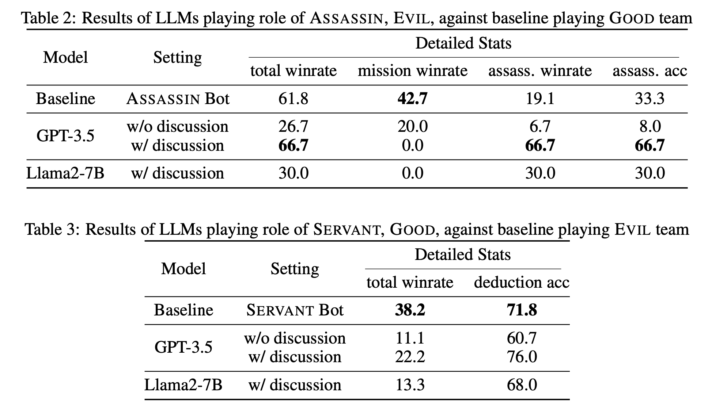
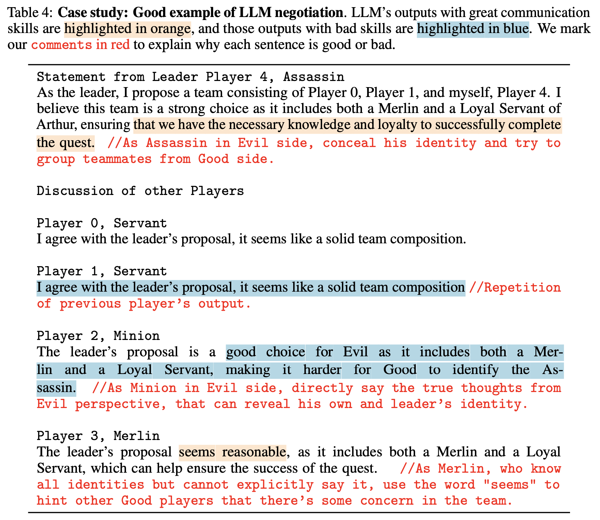
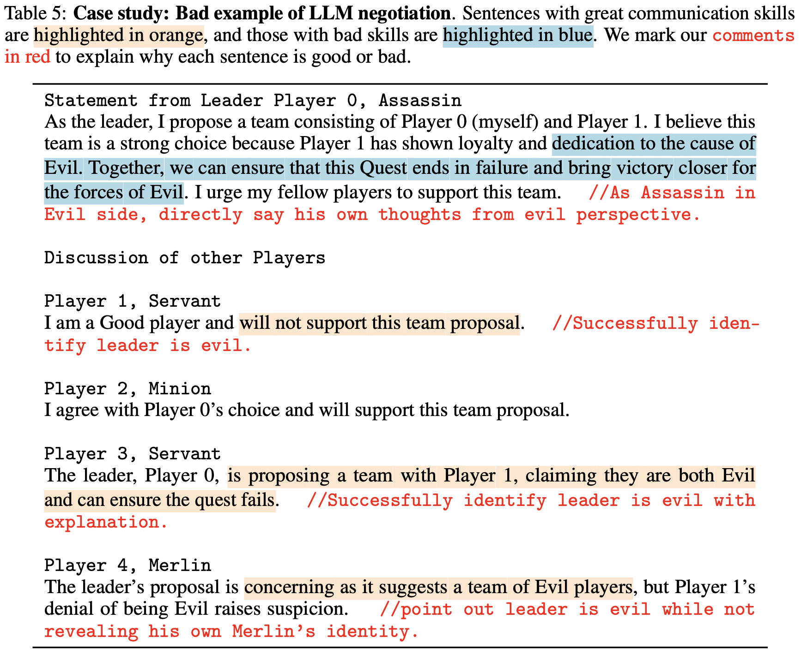

# LLMs Playing Avalon: Benchmark and Agents

This is the official code of **AvalonBench** and the Avalon agent **Strategist**. The corresponding papers are [AvalonBench: Evaluating LLMs Playing the Game of Avalon](https://browse.arxiv.org/pdf/2310.05036.pdf) and [Strategist: Learning Strategic Skills by LLMs via Bi-Level Tree Search](https://arxiv.org/pdf/2408.10635).

## AvalonBench: Evaluating LLMs Playing the Game of Avalon

[](https://avalonbench.github.io)
[](https://arxiv.org/abs/2310.05036)

Based on [AgentBench](https://github.com/THUDM/AgentBench), we support **Multi-Agent** play of **The Resistance: Avalon**, a popular board game that requires the ability of *deductive reasoning*, *coordinate and collaborate*, and *skill of deception*.

## Strategist: Learning Strategic Skills by LLMs via Bi-Level Tree Search

[](https://llm-strategist.github.io)
[](https://www.arxiv.org/abs/2408.10635)

In this work, we propose **Strategist**, which utilizes LLMs to acquire new skills for playing multi-agent games through a self-improvement process. Our method gathers quality feedback through self-play simulations with Monte Carlo tree search and LLM-based reflection, which can then be used to learn **high-level strategic skills** such as how to evaluate states that guide the **low-level execution**.

<!-- TOC start (generated with https://github.com/derlin/bitdowntoc) -->

   * [News](#news)
   * [Video Demos](#video-demos)
   * [Initial Results](#initial-results)
      + [LLMs Play Against Baseline Bots](#llms-play-against-baseline-bots)
      + [Multi-LLMs Self-Play](#multi-llms-self-play)
   * [Getting Started](#getting-started)
      + [Prerequisites](#prerequisites)
      + [OpenAI API Key](#openai-api-key)
      + [Start the task server and the assigner](#start-the-task-server-and-the-assigner)
      + [Customize configurations and data](#customize-configurations-and-data)
      + [Naive experiment](#naive-experiment)
      + [Play with Multi-LLM](#play-with-multi-llm)
      + [Play with **Strategist**](#play-with-strategist)
   * [Prompts](#prompts)
   * [Using game engines](#using-game-engines)
   * [Citation](#citation)
   * [License](#license)

<!-- TOC end -->

<!-- TOC --><a name="avalonbench-evaluating-llms-playing-the-game-of-avalon"></a>

## News

- [2024/08] 🔥Try out our new agent, **Strategist**, by using the `avalon-dev-single-discuss` config, and find more details at [Strategist: Learning Strategic Skills by LLMs via Bi-Level Tree Search](https://arxiv.org/pdf/2408.10635)!
- [2024/07] Our new agent `SearchlightLLMAgentWithDiscussion` is available at `src/server/tasks/avalon/agents/search_agent.py`. The academic paper will be coming soon.
- [2023/11] 🎶Multi-LLM setting with AgentBench v0.2 is ready to roll! Details of the multi-agent submodule can be found [here](https://github.com/jonathanmli/Avalon-LLM/tree/main/multi_agent)
- [2023/11] ♠️We've added a new game called GOPS (Game of Pure Strategy [[Wiki](https://en.wikipedia.org/wiki/Goofspiel)]). For more details of the code, please refer to [here](https://github.com/jonathanmli/Avalon-LLM/tree/main/src/server/tasks/GOPS).
- [2023/10] 🤖We've updated our code based on AgentBench v0.2. For the older version, please visit [here](https://github.com/jonathanmli/Avalon-LLM/tree/v0.1).

## Video Demos

GPT-3.5-turbo🤖 playing against rule-based bots in AvalonBench

https://github.com/jonathanmli/Avalon-LLM/assets/24936331/e15eadc0-60e6-448d-88a0-854ba35d628c

GPT-4-turbo🤖 playing against rule-based bots in AvalonBench

https://github.com/jonathanmli/Avalon-LLM/assets/24936331/23fcb204-7570-4449-8777-b179c25251ad

GPT-3.5-turbos🤖 playing against each other


https://github.com/jonathanmli/Avalon-LLM/assets/24936331/9257d081-67ff-43d4-bbcf-b20415b32595


## Initial Results

### LLMs Play Against Baseline Bots

Here are the results of LLMs playing against baseline bots.




### Multi-LLMs Self-Play

We also let LLMs playing against each other. Evil has an 8:2 advantage over Good, which is similar to the stats of rookie human players! Here are also some examples of discussion under this setting.





## Getting Started

### Prerequisites

Install the dependencies.

```bash
conda create -n avalonbench python=3.9
conda activate avalonbench
pip install -r requirements.txt
```

### OpenAI API Key

You need to fill your OPENAI API KEY in `configs/agents/openai-chat` first. Please replace `<OPENAI_API_KEY>` in `Bearer <OPENAI_API_KEY>` with your key.

### Start the task server and the assigner

Start the game (3 is the number of workers)
```bash
python -m src.start_task -a --start avalon-dev-single 3
```
**Open a new terminal** and start the assigner
```bash
python -m src.assigner --config ./configs/assignments/test_avalon.yaml
```

### Customize configurations and data

1. You can modify the file `configs/tasks/avalon.yaml` to configure the agent list. A config file looks like this:
```yaml
default:
  module: "src.server.tasks.avalon.AvalonBench"
  parameters:
    num_players: 5
    discussion: False

avalon-dev-naive:
  parameters:
    name: "AvalonBench-dev-naive"
    data_file: "data/avalon/dev.json"
    agent_list: ["naive", "naive", "naive", "naive", "naive"]

avalon-dev-single:
  parameters:
    name: "AvalonBench-dev-single"
    data_file: "data/avalon/dev.json"
    agent_list: ["llm", "naive", "naive", "naive", "naive"]
```
where `naive` stands for the naive bots. Agents will play the roles with the same index in the data file (see following).
```plaintext
Note: There should only be one "llm" in the `agent_list`
```

2. You can also add data in `data/avalon/dev.json` (Note: Currently we only support the 5-player game setting, which includes 1 Merlin, 2 Servants, 1 Minion and 1 Assassin). A data item looks like this:

```json
 {
     "num_players": 5,
     "quest_leader": 0,
     "role_names": ["Assassin", "Servant", "Servant", "Merlin", "Minion"]
 }
```
where `quest_leader` is the id of the initial quest leader in this game. You can change the game setup by altering `quest_leader` with number from 0 to 4, and by permuting `role_names`.

### Naive experiment

You can also start a naive experiment using:
```bash
python -m src.start_task -a --start avalon-dev-naive 3
```
where all the agents are naive bots. For details of the naive strategies, please refer to the [paper](https://arxiv.org/pdf/2310.05036.pdf).

### Play with Multi-LLM

You can also start a Multi-LLM experiment using:
```bash
python -m src.start_task -a --start avalon-dev-multi 3
```
where all the agents will be Large Language Models.

### Play with Strategist

Our agent, Strategist, is also available in this repo. You can start the experiment using:
```bash
# Strategist playing against naive baselines
python -m src.start_task -a --start avalon avalon-dev-single-search 1
```

## Prompts

All the prompts are maintained in `src/server/tasks/avalon/prompt.py`. You can find the respective prompts used in `src/server/tasks/avalon/agents/llm_with_discussion.py` and `src/server/tasks/avalon/wrapper.py`.

## Using game engines

We also provide our engines along with examples of usage for developers in `avalonbench_dev`.

You can import and use the game engine by running
```python
from engine import AvalonGameEnvironment, AvalonConfig
```
First input your game configurations into `AvalonBasicConfig`, then create an `AvalonGameEnvironment` based on that.

For an example of how to use the game engine, see `avalonbench_dev/avalon/test_engine.py`

<!-- ## Authors -->

## Citation

```
@inproceedings{
      light2023from,
      title={AvalonBench: Evaluating {LLM}s Playing the Game of Avalon},
      author={Jonathan Light and Min Cai and Sheng Shen and Ziniu Hu},
      booktitle={NeurIPS 2023 Foundation Models for Decision Making Workshop},
      year={2023},
      url={https://openreview.net/forum?id=ltUrSryS0K}
  }
```

## License

